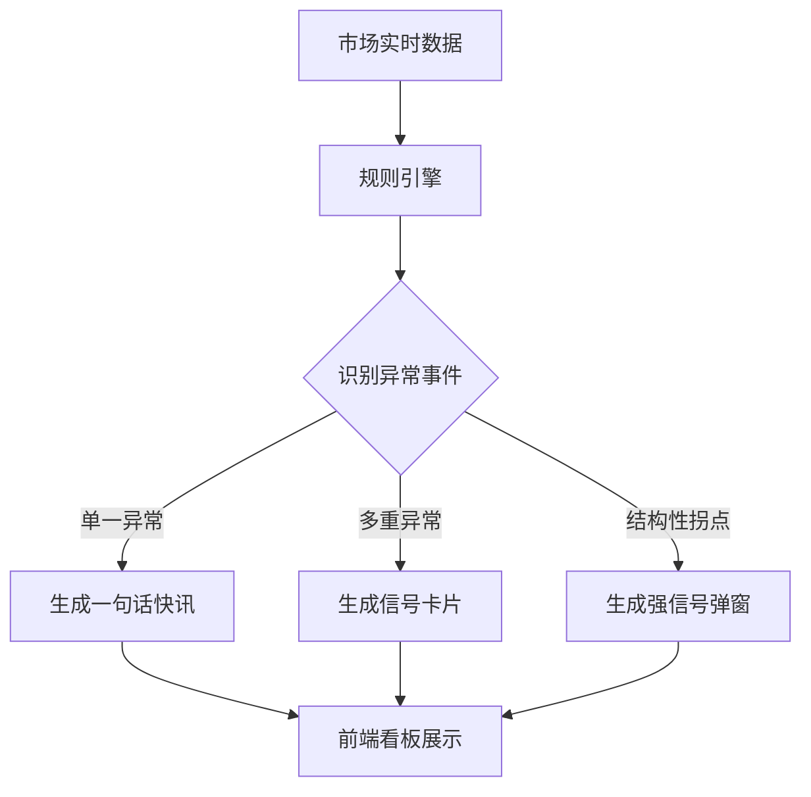

# AI 盘中 A 股市场追踪工具产品需求文档

## 1. 产品概述

本产品是一款面向 A 股市场的 AI 盘中追踪工具，旨在通过“分钟级/小时级”监测市场变化，识别关键异常并以极简方式反馈给用户。

* **核心价值**：帮助用户快速感知盘中结构变化，识别情绪、资金、题材的拐点。

* **边界**：仅限 A 股，严禁提供投资建议或目标价。

## 2. 核心功能

### 2.1 用户角色

| 角色   | 注册方式        | 核心权限                  |
| ---- | ----------- | --------------------- |
| 普通用户 | 无需注册或简单设备绑定 | 查看实时盘中信号、市场状态灯、设置关注偏好 |

### 2.2 功能模块

本工具主要包含以下核心页面：

1. **盘中监控看板**：核心页面，展示市场状态灯、实时信号流（快讯/卡片）。
2. **设置页面**：配置异常检测的阈值偏好、消息通知过滤。

### 2.3 页面详情

| 页面名称       | 模块名称                | 功能描述                                           |
| ---------- | ------------------- | ---------------------------------------------- |
| **盘中监控看板** | 市场状态灯 (MarketState) | 实时显示当前市场状态（红/黄/绿），基于情绪与资金的综合打分，不主动打扰。          |
|       | 实时信号流 (Live Feed)   | 瀑布流展示“一句话快讯”和“信号卡片”。快讯（1行）展示单一异常；卡片（3行）展示叠加异常。 |
|       | 强信号弹窗 (Popup)       | 仅在盘中出现结构性拐点时触发（每日限3次），展示关键变化，需用户手动关闭。          |
| **设置页面**   | 偏好配置                | 用户可开关特定类型的异常通知（如“屏蔽资金流向预警”）。                   |

## 3. 核心流程

### 3.1 异常监测与推送流程

系统持续摄取市场数据，经过规则引擎处理后生成事件，聚合为通知推送给前端。

## 4. 用户界面设计

### 4.1 设计风格

* **整体风格**：极简主义，金融终端风格，强调信息密度与阅读效率。

* **配色**：

  * 背景：深色模式（Dark Mode）以减少视觉疲劳。

  * 信号色：红（多头/转强）、绿（空头/转弱）、黄（中性/预警）。

* **字体**：系统默认无衬线字体，数字采用等宽字体。

* **布局**：左侧/顶部为状态灯常驻，主区域为信号流。

### 4.2 页面设计概览

| 页面名称   | 模块名称 | UI 元素                            |
| ------ | ---- | -------------------------------- |
| 盘中监控看板 | 信号卡片 | 卡片式设计，包含时间戳、异常类型图标、核心描述文本。高亮关键词。 |
|   | 状态灯  | 拟物化红绿灯或简单的色块指示器，伴随微弱呼吸动画表示系统在线。  |

### 4.3 响应式设计

* **优先适配**：桌面端（Desktop-first），适合交易员多屏场景。

* **移动端**：自适应布局，信号流转为单列显示。

