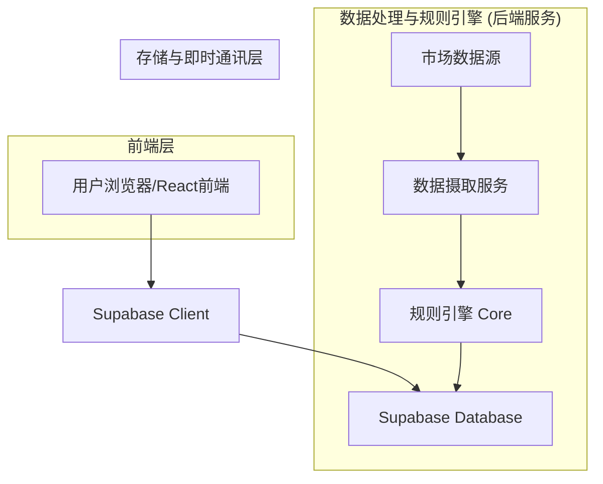
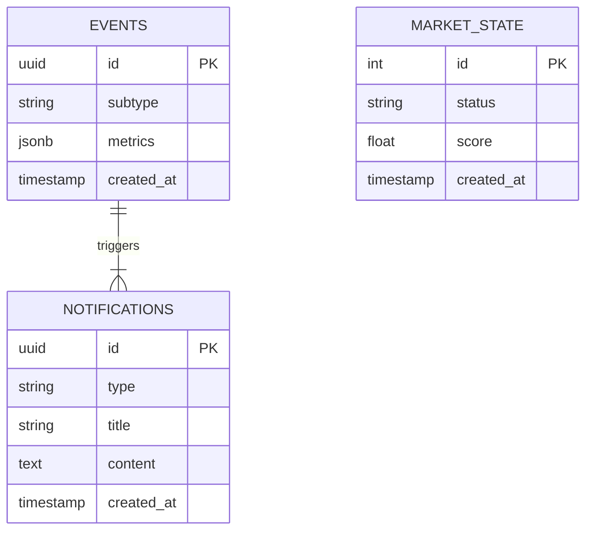

# AI 盘中 A 股市场追踪工具技术架构文档

## 1. 架构设计

系统采用前端轻量化展示 + 后端规则引擎计算的架构。由于涉及实时高频数据处理，需要独立的计算服务层。



## 2. 技术说明
- **前端**：React@18 + TailwindCSS + Vite + Recharts (用于简单的趋势可视化)
- **初始化工具**：vite-init
- **后端 (BaaS)**：Supabase (PostgreSQL, Realtime, Edge Functions)
- **规则引擎服务**：Node.js 或 Python (独立运行，负责分钟级轮询与计算，将结果写入 Supabase)

## 3. 路由定义
| 路由 | 用途 |
|------|------|
| / | 盘中监控看板，包含状态灯和信号流 |
| /settings | 设置页面，配置通知过滤规则 |

## 4. API 定义与规则引擎逻辑

### 4.1 规则引擎实现逻辑 (MVP)
规则引擎基于“滑动窗口”与“基准偏离”进行判断。
- **时间窗口**：过去 15-30 分钟。
- **异常分类 (Subtypes)**：
  1. **sentiment_turning_up (情绪转强)**: 涨停家数/成交额 MA5 上穿 MA15，且炸板率下降。
  2. **sentiment_turning_down (情绪转弱)**: 跌停家数激增 或 连板高度断层。
  3. **flow_reversal (资金回流)**: 北向资金/主力资金流向由负转正，且斜率超过阈值。
  4. **flow_withdrawal (资金撤离)**: 资金流向大幅流出，背离指数走势。
  5. **theme_emergence (新主线)**: 某板块 5分钟涨幅排序急剧上升，且板块内多股涨停。
  6. **theme_exhaustion (主线衰竭)**: 龙头股炸板/跳水，板块整体回落。

### 4.2 核心数据结构 (JSON Schema)

#### 1) Event (原始异常事件)
```typescript
interface Event {
  id: string;
  timestamp: number;
  subtype: 'sentiment_turning_up' | 'sentiment_turning_down' | 'flow_reversal' | 'flow_withdrawal' | 'theme_emergence' | 'theme_exhaustion';
  level: 'info' | 'warning' | 'critical';
  metrics: {
    [key: string]: number; // 例如: "vol_delta": 20%
  };
  description: string; // 原始描述
}
```

#### 2) Notification (用户推送)
```typescript
interface Notification {
  id: string;
  event_ids: string[]; // 关联的原始事件ID，支持聚合
  type: 'flash' | 'card' | 'popup'; // 输出形式
  title: string;
  content: string[]; // 事实描述列表，不超过3行
  created_at: string;
}
```

#### 3) MarketState (市场状态)
```typescript
interface MarketState {
  status: 'red' | 'yellow' | 'green';
  score: number; // 0-100
  updated_at: string;
  summary: string; // 简短状态描述
}
```

## 5. 服务端架构图
展示数据流转与异常识别过程。

```mermaid
graph TD
  Source[行情数据API] --> Ingest[数据清洗与标准化]
  Ingest --> Window[滑动窗口缓存 (15-30min)]
  Window --> Detector[异常检测器]
  
  Detector -->|匹配规则| EventGen[生成 Event]
  EventGen --> Aggregator[事件聚合 & 节流]
  Aggregator --> NotifyGen[生成 Notification]
  
  NotifyGen --> DB[(Supabase DB)]
  DB -->|Realtime 推送| Client[前端展示]
```

## 6. 数据模型

### 6.1 数据模型定义


### 6.2 数据定义语言 (DDL)
```sql
-- 市场状态表
CREATE TABLE market_states (
    id BIGINT GENERATED BY DEFAULT AS IDENTITY PRIMARY KEY,
    status VARCHAR(10) CHECK (status IN ('red', 'yellow', 'green')),
    score NUMERIC,
    summary TEXT,
    created_at TIMESTAMP WITH TIME ZONE DEFAULT NOW()
);

-- 原始事件表
CREATE TABLE events (
    id UUID PRIMARY KEY DEFAULT gen_random_uuid(),
    subtype VARCHAR(50) NOT NULL,
    level VARCHAR(20),
    metrics JSONB,
    description TEXT,
    created_at TIMESTAMP WITH TIME ZONE DEFAULT NOW()
);

-- 通知表
CREATE TABLE notifications (
    id UUID PRIMARY KEY DEFAULT gen_random_uuid(),
    type VARCHAR(20) CHECK (type IN ('flash', 'card', 'popup')),
    title VARCHAR(100),
    content TEXT[], -- 数组存储多行内容
    event_ids UUID[], -- 关联事件ID数组
    created_at TIMESTAMP WITH TIME ZONE DEFAULT NOW()
);

-- 开启 Realtime
alter publication supabase_realtime add table notifications;
alter publication supabase_realtime add table market_states;
```
